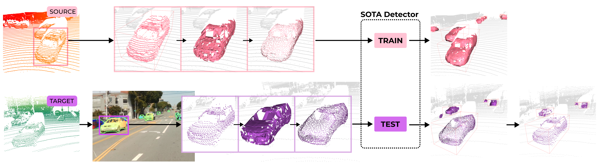

# SEE-MTDA

Code release for the paper **See Eye to Eye: A Lidar-Agnostic 3D Detection Framework for Unsupervised Multi-Target Domain Adaptation**



Our code is based on [OpenPCDet v0.3.0](https://github.com/open-mmlab/OpenPCDet/tree/v0.3.0) with DA configurations adopted from [ST3D](https://github.com/CVMI-Lab/ST3D). 

## Model Zoo
Please place all downloaded models into the `model_zoo` folder. See `model_zoo/README.md` for more details. 

### Instance Segmentation Models
Pre-trained instance segmentation models can be obtained from the model zoo of [mmdetection](https://github.com/open-mmlab/mmdetection). Our paper uses 
Hybrid Task Cascade (download model [here](https://download.openmmlab.com/mmdetection/v2.0/htc/htc_x101_64x4d_fpn_dconv_c3-c5_mstrain_400_1400_16x1_20e_coco/htc_x101_64x4d_fpn_dconv_c3-c5_mstrain_400_1400_16x1_20e_coco_20200312-946fd751.pth)).

### Source: Waymo
| Source | Model | Method | Download | 
|--------|------:|:------:|:--------:|
| Waymo | SECOND-IoU | SEE | [model](https://drive.google.com/file/d/1AP436Sq8XKM6sU8MchHgUKTKKgVavvQl/view?usp=sharing) |
| Waymo | PV-RCNN | SEE | [model](https://drive.google.com/file/d/1oaRA-LZelDKfU8eFii_h6VYeoYnXjAix/view?usp=sharing) |

Due to the [Waymo Dataset License Agreement](https://waymo.com/open/terms/) we can't provide the Source-only models for the above. You should achieve a similar performance by training with the default configs. 

### Source: nuScenes
| Source | Model | Method | Download | 
|--------|------:|:------:|:--------:|
| nuScenes | SECOND-IoU | Source-only | [model](https://drive.google.com/file/d/1ZDJqBWJzM-cfCYj_nrtRMNSXauv5enUz/view?usp=sharing) | 
| nuScenes | SECOND-IoU | SEE | [model](https://drive.google.com/file/d/1NkjttovNoNvktSFwJu-RCc6Qv4ErRsTf/view?usp=sharing) |
| nuScenes | PV-RCNN | Source-only | [model](https://drive.google.com/file/d/1vDEErtKlRWdmDM0bqaQhq9iQApR0Hl6C/view?usp=sharing) | 
| nuScenes | PV-RCNN | SEE | [model](https://drive.google.com/file/d/1NBBClCyapwf5vEds_XDGJqUV68RpIwJx/view?usp=sharing) |

## Installation
This repo is structured in 2 parts: see and detector. For each part, we have provided a separate docker image which can be obtained as follows:
- `docker pull anonymoustofu/see-mtda:see-v1.0`
- `docker pull anonymoustofu/see-mtda:detector-v1.0`

We have provided a `docker/run.sh` to launch the necessary docker images as well for each part. Please edit the folder names for mounting local volumes into the docker image. We currently do not provide other installation methods but refer to `docker/see/Dockerfile` or `docker/detector/Dockerfile` for more information about installation requirements. 

## Dataset Preparation
Please refer to `docs/DATASET_PREPARATION.md` instructions on downloading and preparing datasets. 

## Usage

For (1) and (2), run the following docker image with our provided script:
```
bash docker/run.sh -i see
```

#### (1) Image instance segmentation
Get instance masks for all images. 
```
cd see
bash prepare_baraja_masks.sh
```

#### (2) SEE Framework
Here we transform our objects into the canonical domain i.e. we isolate the objects, create meshes and sample from them. 
```
cd see
python surface_completion.py --cfg_file cfgs/BAR-DM-ORH005.yaml
```

#### (3) Point Cloud Detector 
To run train/test the detector, run the following docker image with our provided script:
```
bash docker/run.sh -i detector
```
For training, see the following example. Replace the cfg file with any of the other cfg files in the `tools/cfgs` folder. 
```
cd detector/tools
python train.py --cfg_file cfgs/source-waymo/secondiou/see/secondiou_ros_custom1000_GM-ORH005.yaml
```

For testing, download the models from the links above and modify the cfg and ckpt paths below. For the cfg files, please link to the yaml files in the output folder instead of the ones in the `tools/cfg` folder. 
```
cd detector/tools
python test.py --cfg_file /SEE-MTDA/detector/output/source-waymo/secondiou/see/secondiou_ros_custom1000_GM-ORH005/default/secondiou_ros_custom1000_GM-ORH005_eval-baraja100.yaml \
--ckpt /SEE-MTDA/detector/output/SEE-models/w-k_secondiou_see_6552.pth \
--batch_size 1
```
